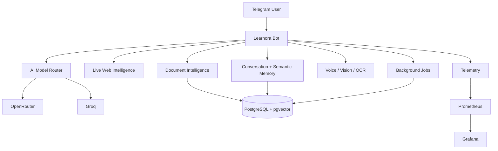

# Learnora AI Platform — Public Showcase

**Learnora** is a production-oriented Telegram AI learning platform designed to combine AI chat, live web intelligence, semantic memory, hybrid document RAG, multimodal workflows, durable background jobs, and production observability in one user-facing system.

> This repository is a **public showcase only**. It intentionally does **not** contain production source code, secrets, internal infrastructure details, private deployment configuration, or user data.

[فارسی](README.fa.md) · [Architecture](docs/architecture.md) · [Features](docs/features.md) · [RAG & Memory](docs/rag-memory.md) · [Observability](docs/observability.md) · [Security](docs/security-overview.md)

## What Learnora is

Learnora started as a Telegram AI assistant and evolved into a broader AI learning platform with a production-oriented backend.

The current platform includes:

- **Multi-provider AI routing** with fallback between OpenRouter and Groq
- **Live web intelligence** for fresh/current questions
- **Semantic long-term memory**
- **Hybrid document RAG** using lexical + vector retrieval + reranking
- **PDF/document Q&A**
- **Voice transcription and study workflows**
- **OCR and image understanding**
- **Study planner, quiz, flashcards, summaries, translation, writing tools**
- **Durable PostgreSQL background jobs**
- **Health/readiness endpoints**
- **Prometheus + Grafana observability**
- **Operational Telegram commands such as `/ops` and `/admin`**

## Human-first UX

The main Telegram menu is intentionally simple:

```text
✨ Ask Learnora

📚 Study & Practice      📄 Files

🎙 Voice & Image         ✍️ Create & Work

👤 My Learnora
```

The user does not need to know terms such as RAG, pgvector, model routing, OCR, or background workers. Those capabilities stay behind intent-based user flows.

## Architecture



For a deeper walkthrough, see [docs/architecture.md](docs/architecture.md).

## Technology stack

| Layer | Technologies |
|---|---|
| Runtime | Node.js 22 |
| Bot | Telegram Bot API, grammY |
| Database | PostgreSQL |
| Vector search | pgvector |
| AI providers | OpenRouter, Groq |
| Web intelligence | Live provider-assisted web search |
| Media | ffmpeg, OCR, transcription pipelines |
| Deployment | Debian, systemd, Docker |
| Observability | Prometheus, Grafana |
| CI / Validation | Automated regression, preflight, smoke testing |

## RAG and semantic memory

Learnora uses a hybrid retrieval design:

```text
User Question
    ↓
Lexical Retrieval
    +
Vector Retrieval
    ↓
Candidate Fusion
    ↓
Reranking
    ↓
Best Evidence
    ↓
AI Answer + Source Context
```

The system can degrade to lexical retrieval if vector search is unavailable.

Semantic memory is separate from normal conversation history and is intended for reusable user context such as preferences, goals, project context, and learning preferences.

Read more in [docs/rag-memory.md](docs/rag-memory.md).

## Reliability and provider failover

Different task types use different latency budgets and provider priorities.

Example production routing strategy:

```text
Fast tasks       → lowest-latency healthy provider
Balanced chat    → preferred provider + fallback
Reasoning        → stronger reasoning route
Web questions    → web-capable route
```

Provider health, success/failure state, cooldown status, and latency are monitored so unhealthy routes do not repeatedly degrade the user experience.

## Production observability

Learnora exposes operational health through:

- application liveness endpoint
- readiness endpoint
- protected Prometheus metrics
- Grafana dashboards
- provider latency telemetry
- queue state
- background job state
- vector readiness
- AI request P50/P95
- operational Telegram command `/ops`

Example operational view from a working v4.1 deployment:

```text
Learnora ops · v4.1.0

Vector RAG (files/memory): on/on
Semantic memory: on
Metrics: on
Queue pending/running/dead: 0/0/0
AI P50/P95: ~2.4s / ~4.5s
```

These numbers are deployment-specific and are shown only as an example from one real test environment.

## Validation

The v4.1 development/release line was validated using multiple suites, including:

- full regression testing
- AI/intelligence evaluation
- RAG-specific testing
- web/performance testing
- hardening tests
- platform-level tests
- release-specific validation

See [docs/validation.md](docs/validation.md).

## Security model

The public repository excludes:

- production source code
- `.env`
- Telegram bot token
- provider API keys
- database credentials
- internal IP addresses
- proxy credentials
- private infrastructure details
- production logs
- user data

More detail: [docs/security-overview.md](docs/security-overview.md).

## Portfolio summary

> Built Learnora v4.1, a production-oriented Telegram AI learning platform integrating live web intelligence, semantic long-term memory, hybrid RAG with pgvector, multimodal document/voice/image workflows, multi-provider AI failover, durable PostgreSQL jobs, and Prometheus/Grafana observability.

See [docs/portfolio.md](docs/portfolio.md) for résumé and interview-ready wording.

## Repository purpose

This repository exists to demonstrate:

- architecture decisions
- feature scope
- production engineering approach
- AI/RAG design
- observability strategy
- security separation between public portfolio material and private production code

The actual production repository remains private.