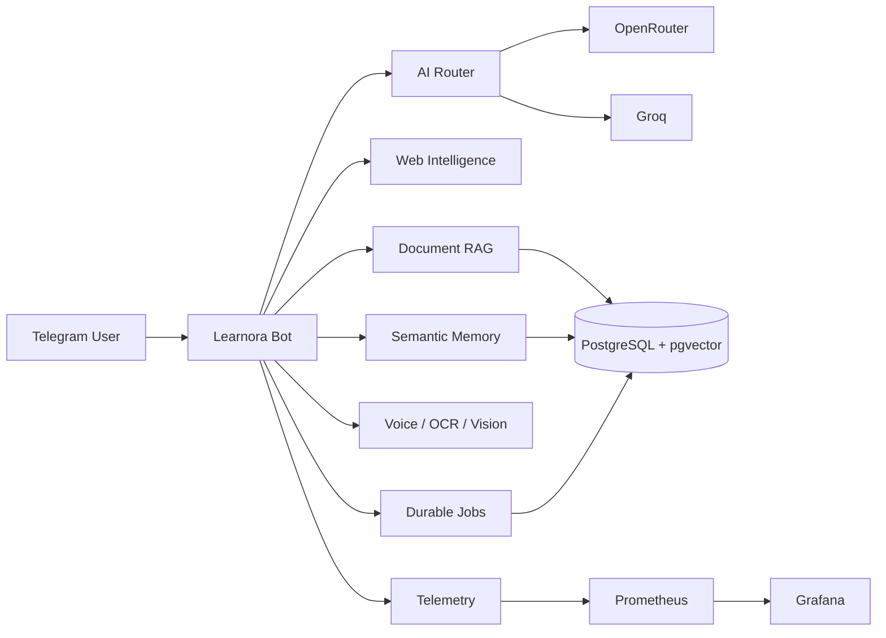

# Architecture

## Design goals

1. Keep user-facing UX simple.
2. Keep provider failure from causing excessive tail latency.
3. Preserve lexical retrieval if vector infrastructure is unavailable.
4. Separate short-term conversation context from long-term semantic memory.
5. Keep long-running work outside the critical request path when possible.
6. Make production health observable.